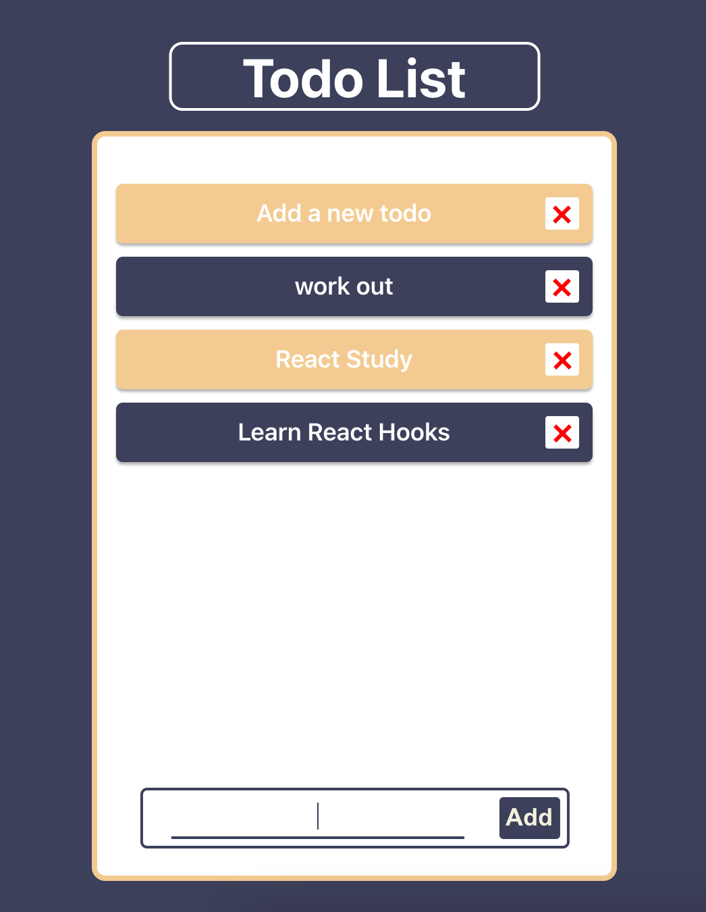

# [React] 리액트로 만드는 TODO LIST

&nbsp;나의 리액트 첫 프로젝트로 자바스크립트로 만들어봤던 **투두리스트**를 리액트로 만들어 봤다. HTML을 자바스크립트 안에서 간단하게 조작하고 만들 수 있어서 요소를 배치하고 화면을 구성하는 것은 정말 편하다고 느꼈다. 하지만 아직 리액트를 잘 알지 못해서 오히려 자바스크립트에서 쉽게 다루던 함수들을 조작하기 어려웠던 것 같다.

<!-- 프로젝트에 대한 간단한 설명 -->

## 1. Description

- 목적: **Todo List**를 만들면서 리액트에 익숙해지기
- DEMO 링크: https://brad-go.github.io/react-todo-list
- 제작 기간: 2021.01.11 ~ 2021.01.15

<!-- 사용된 기술 -->

## 2. Built with


######

- HTML5
- CSS3
- JAVASCRIPT
- **REACT.js**
- Node.js (v.16.6.2)
- npm (v.7.20.3)
- VisualStudioCode
- Git & GitHub

<!-- 작업 목록 체크리스트 -->

## 3. Roadmap

- [x] todo 추가 기능 만들기
- [x] todo 삭제 기능 만들기
- [ ] todo 변경 기능 만들기
- [x] todo 완료 처리 기능 만들기
- [x] 새로고침 시에도 저장한 todo를 불러와서 화면에 렌더링하기
- [x] 화면 크기에 맞춰서 반응형으로 만들기

<!-- 사용된 파일들의 설명 -->

## 4. File Description

- `App.js`: HTML 구조의 큰 뼈대와 이 프로젝트의 핵심인 **todo**들을 관리하는 파일
- `TodoList.js`: `App.js`에서 생성한 **todo**들을 화면에 구현해주는 파일
- `CreateTodo.js`: **todo**들을 생성할 수 있게 해주는 form을 구현한 파일

## 5. Getting Started

<!-- 작성한 코드를 실행하기 전 설치해야 할 파일 이나 패키지 등 -->

이 프로젝트를 로컬에 저장해서 사용하기 위해서는 다음과 같은 작업이 필요합니다.

### Prerequisite

- Browser: Javascript 1.7이상을 지원하는 크롬 브라우저에서 실행을 권장
- OS: Mac OS Monterey 12.0.1의 환경에서 개발을 진행했습니다.

#### Installation

1. Clone this repo
   ```
    git clone https://github.com/brad-go/Gardner.git
   ```
2. Node.js
   [Node.js설치하기](https://nodejs.org/ko/)
   설치 후에 터미널에서 아래와 같이 입력을 통해 설치가 되었는지 확인할 수 있습니다.
   ```
    node --version
   ```
3. npm
   Node.js를 설치하면 npm이 자동으로 설치되어 있을 것이다. 아래의 입력을 통해 확인해 볼 수 있습니다.
   ```
    npm --version
   ```

<!-- 작성한 코드를 어떻게 실행해야 하는지에 대한 가이드 라인 -->

## 6. Usage

1. 프로젝트의 디렉토리로 이동하기
   ```
    cd todo-list
   ```
2. 프로젝트 실행하기
   ```
    npm start
   ```

<div align="center" justify="space-between">
  
  
  
  
</div>

#### 동작

1. 기본 화면에서 아래의 `input`을 통해 할 일을 입력하고 **엔터**를 누르거나 **'Add' 버튼**을 클릭해서 할 일을 추가할 수 있습니다.
2. todo에 **마우스를 올리면** 배경이 **녹색**으로 변경됩니다.
3. todo를 클릭하면 **회색**으로 변화하며 이는 **완료**를 나타냅니다.
4. x버튼에 마우스를 올리면 todo의 배경이 **붉은색**으로 변하며 클릭하면 할 일이 **삭제** 됩니다.

## 7. 핵심 기능

이 프로젝트의 핵심 기능은 할 일(todo)를 생성하고, 읽어오고, 삭제하는 기능입니다. 간단한 클릭만으로 동작할 수 있게 생성했습니다. 이 앱은 로컬 스토리지를 이용해서 todo를 저장하고 읽어옵니다.

1. 앱이 실행되면 로컬 스토리지에 저장한 데이터가 있는지 확인하고 있다면 화면에 렌더링 합니다. [📌 코드 확인](https://github.com/brad-go/react-todo-list/blob/master/src/App.js#L29)
2. 사용자가 원하는 할 일을 입력하고 양식 제출을 통해서 새로운 할 일을 화면에 저장할 수 있습니다. [📌 코드 확인](https://github.com/brad-go/react-todo-list/blob/master/src/components/CreateTodo.js#L4)
3. 'x버튼'을 클릭해서 할 일을 삭제할 수 있습니다. [📌 코드 확인](https://github.com/brad-go/react-todo-list/blob/master/src/App.js#L12)
4. 양식 제출이나 삭제를 통해 todo가 변경되면 localStarage에 저장합니다. [📌 코드 확인](https://github.com/brad-go/react-todo-list/blob/master/src/App.js#L38)

## 8. Trouble Shooting

### 8.1. 핵심 트러블 슈팅

#### setState의 비동기 동작 문제

##### 원하던 동작

- input을 통해서 제출이 일어나면 화면에 렌더링 됨과 동시에 로컬 스토리지에 저장되기를 원했습니다.

##### 문제

- 로컬 스토리지에 저장은 되지만 저장이나 삭제 시에 setter 함수로 업데이트를 해줘도 제출이 한번 더 일어나기 전까지 로컬 스토리지에 저장하지 못했습니다.
- 즉, 마지막에 추가한 todo는 로컬스토리지에 추가하지 못했습니다.

<details>
<summary><b>기존 코드</b></summary>
<div markdown="1">

```javascript
const TODOS_KEY = "todos";
const [todos, setTodos] = useState(["Try adding a new todo"]);

const saveTodos = () => {
  localStorage.setItem(TODOS_KEY, JSON.stringify(todos));
};

const deleteTodo = (idx) => {
  setTodos(
    todos.filter((todo, i) => {
      return i !== idx;
    })
  );
  saveTodos();
};

// CreateTodo.js 파일에서 호출되는 함수
// 입력받은 input값을 인자로 받으면 todos의 상태를 업데이트 해준다.
const handleSubmit = (newTodo) => {
  setTodos([...todos, newTodo]);
  saveTodos();
};
```

</div>
</details>

##### 해결

- `useEffect()`를 통해 `todos`의 상태를 감지하게 해서 문제를 해결할 수 있었습니다.
- 여기저기 콘솔을 찍어보면서 `setState()`로 `todos`의 상태를 변경해도 곧바로 상태가 변경되지 않는 것을 알게 되었습니다.
- 즉, `setState()`가 비동기적으로 동작한다는 것을 알게 되었습니다.
- 그래서 이 비동기성을 동기성으로 동기화 시켜주기 위해서 `useEffect()`를 통해서 첫 렌더링 시에도, 배열이 변경될 때도 감지해서 `todos`의 상태를 변경해주었습니다.

<details>
<summary><b>개선된 코드</b></summary>
<div markdown="1">

```javascript
const TODOS_KEY = 'todos';

  const [ todos, setTodos ] = useState(['Try adding a new todo']);

  const deleteTodo = (idx) => {
    setTodos(todos.filter((todo, i) => {
      return i !== idx;
    }));
  }

  const handleSubmit = (newTodo) => {
    if (todos.length <= 7) {
      setTodos([...todos, newTodo]);
    }
  }

  ...

  // 제출과 삭제 시에 동작하기보다 변경되기보다 todo가 변경될 때마다 localStorage에 저장하게 했습니다.
  // saveTodos() 대신에 useEffect를 사용했습니다.
  useEffect(() => {
    if (todos.length <= 8) {
      localStorage.setItem(TODOS_KEY, JSON.stringify(todos));
    }
  }, [todos])
```

</div>
</details>

### 8.2. 그외 트러블 슈팅

<details>
<summary><b>input 상태 관리 오류 문제</b></summary>
<div markdown="1">

#### 원하던 동작

: `CreateTodo.js`파일의 `submitForm()`함수를 통해서 새로운 투두를 작성해 제출하면 인풋값이 비워지길 원했다.

#### 문제

##### 기존 코드

```javascript
const CreateTodo = (props) => {
  const [ todo, setTodo ] = useState('');

  ...

  const submitForm = (e) => {
    e.preventDefault();
    props.handleSubmit(todo);
    // input값을 공백으로 변경한다고 생각했다.
    setTodo('');
  }

  return (
    <form className="todo-create">
      <input type="text" onChange={handleChange} />
      <button onClick={submitForm}>Add</button>
    </form>
  );
}
```

setter 함수를 통해서 인풋값을 초기값으로 변경해도 인풋창에는
텍스트가 그대로 남아있었고, 그 상태로 한 번더 제출하면 입력값을 추가로 입력하기 전까지는 입력값이 써있어도 공백 상태의 todo가 추가되는 문제가 발생했습니다.

#### 해결

> `input`에 `value` 값으로 `state`인 `todo`를 넘겨줌으로 해결

- `input`의 상태관리 문제였습니다.
- `onChange`를 통해서 `e.target.value` 가져와서 `input`에 입력된 값을 가져오고는 있었지만, 이 값을 `useState`를 통해 상태관리를 해줘야 한단 것을 몰랐었습니다.
- 나는 setter함수를 통해서 state를 변경하고는 있었지만, 이 값이 input에 연결되어 있지 않아서 아무리 해도 `input`값을 비울 수 없었던 것입니다.
- **핵심**: `input` 의 상태를 관리할 때에는 `input` 태그의 value 값도 설정해줘야 한다는 것을 알았습니다. 그렇게 해야, 상태가 바뀌었을때 `input` 의 내용도 업데이트 된다는 것을...!

##### 바뀐 코드

```javascript
const CreateTodo = (props) => {
  const initialState = '';

  const [ todo, setTodo ] = useState(initialState);

  ...

  const submitForm = (e) => {
    e.preventDefault();
    props.handleSubmit(todo);
    setTodo(initialState);
  }

  return (
    <form className="todo-create">
      input의 상태관리를 위해 value로
      <input type="text" value={todo} onChange={handleChange} />
      <button onClick={submitForm}>Add</button>
    </form>
  );
}
```

</div>
</details>

<details>
<summary><b>부모 태그의 이벤트가 하위 태그에서도 발생하는 문제</b></summary>
<div markdown="1">

#### 문제

`onClick` 이벤트 전파로 인해 todo를 클릭 시 배경 색이 변경하게 하는 함수 `handleToggleList()` 가 하위 요소인 `button`이나 `span` 태그가 클릭되어도 원하지 않는 클래스 추가되는 문제가 있었습니다.

#### 해결

`button` 태그의 `onClick` 이벤트에 `e.stopPropagation()` 함수를 작성해서 부모 태그인 `li`로부터의 이벤트 전파를 막을 수 있었습니다.

```javascript
<button id="deleteBtn" onClick={(e) => { e.stopPropagation(); props.deleteTodo(idx) }} ... >❌</button>
```

또, `span`태그에는 CSS를 통해 클릭이 되지 않도록 했습니다.

```css
pointer-events: none;
```

</div>
</details>

<details>
<summary><b>useEffect() 두 개중에 하나가 동작하지 않는 문제</b></summary>
<div markdown="1">

#### 문제

localStorage에 `todo`를 저장하는 `useEffect()`와 첫 렌더링 시에 localStorage에 데이터가 있으면 화면에 렌더링 해주는 `useEffect()`, 두 개의 `useEffect()`를 사용했는데, 하나가 동작하지 않았다.

#### 해결

`useEffect()`의 위치가 중요하단 걸 알았습니다. 하나는 생성 시에(componentDidMount) 동작하고 하나는 todos 배열이 렌더링될 때(componentDidUpdate) 동작하게 만들었는데, 첫 렌더링 시에 동작할 `useEffect()`를 위에 위치시키니까 제대로 동작했습니다.

</div>
</details>

<details>
<summary><b>CSS 에서 상위 요소를 선택할 수 없는 문제</b></summary>
<div markdown="1">

#### 원하던 동작

- 삭제 버튼에 마우스를 올리면 todo의 배경 색이 다른 색으로 변경되길 원했습니다.

#### 문제

- 버튼에 hover 시 li의 색상을 바꾸고 싶었는데, CSS에서 hover 시에
  상위 요소를 선택 하기는 쉽지 않았습니다.
- 방법을 찾을 수 없어서 결국 javascript를 이용해서 해결했습니다.
- 처음에는 `state` 변경과 삼항 연산자를 통해서 `state`가 클릭되었냐, 안되었냐에 따라서 `list`의 클래스를 변경하는 방식으로 접근했는데, 모든 `list`의 클래스가 변경되어서 사용하지 않았습니다.
- `useEffect()`를 사용해서는 `e.target`인자를 전달할 방법을 찾을 수 없었습니다.

#### 해결

그래서 좋지 않은 방법이겠지만, `isDone`이라는 변수값을 이용해서
상태 변화에 따라 `li`의 클래스를 직접 변경하는 방식으로 문제를 해결했습니다.

```javascript
let isDone = false;

const handleToggleList = (e) => {
  isDone = !isDone;

  if (isDone) {
    e.target.className = "todo-list__items-done";
  } else {
    e.target.className = "todo-list__items";
  }
};
```

클래스를 직접변경하는 것이 좋은 것 같지 않아서 리액트를 조금 더 잘 다룰 수 있게 된다면 다른 방식으로 다뤄보고 싶습니다.

</div>
</details>

<details>
<summary><b>무한 렌더링 문제</b></summary>
<div markdown="1">

#### 원하던 동작

- 로컬스토리지에 가지고 있는 todo들이 있으면 setter 함수를 이용해서 todos를 변경하려고 했습니다.

#### 문제

`Too many re-renders. React limits the number of renders to prevent an infinite loop.`

- 처음에는 `if문`을 어디에 넣야하지 하고 고민하다가 `useEffect()`를 사용했는데 무한 렌더링이 발생했습니다.
- React가 계속 상태를 업데이트하면서 끊임없이 localStorage에 저장된 `todo`들을 `state`로 계속 변경해서 추가, 삭제, 변경을 할 수 없었던 문제였습니다.

#### 해결

- `useEffect()`를 사용 방법을 알면 간단히 해결할 수 있는 문제였습니다.
- `useEffect()`는 컴포넌트가 렌더링 될 때마다 특정 작업을 실행할 수 있게 해주는 리액트 훅인데, `useEffect()`가 어떻게 동작하는지 알 지 못해서 사용하지 못했었습니다.

```javascript
useEffect(() => {
  const savedTodos = localStorage.getItem(TODOS_KEY);

  if (savedTodos !== null) {
    const parsedTodos = JSON.parse(savedTodos);
    setTodos(parsedTodos);
  }
}, []);
```

> useEffect(실행하고자 하는 함수, deps)

- **핵심**: 컴포넌트가 화면에 가장 처음 렌더링될 때만 함수를 실행하고 싶다면 `deps`에 빈 배열을 넣으면 된다는 것을 알게 되었습니다!
</div>
</details>
